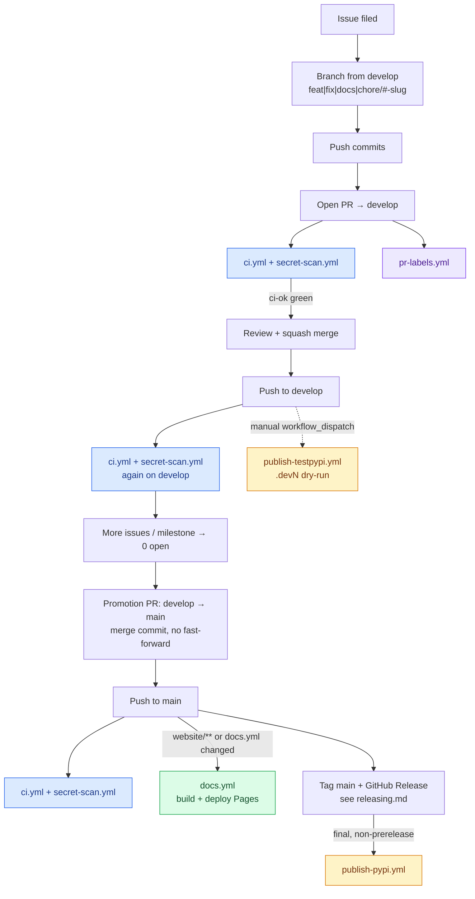
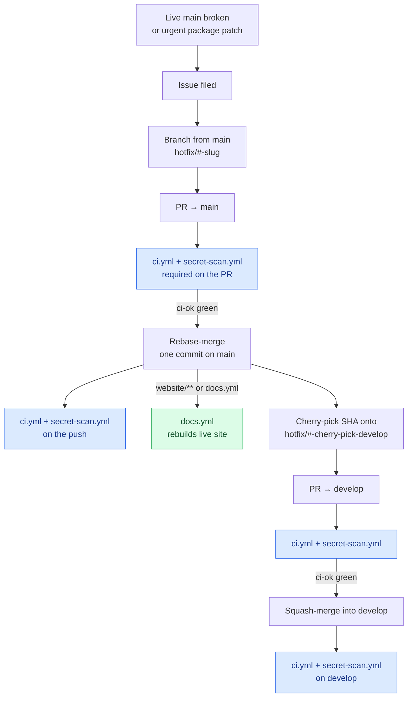
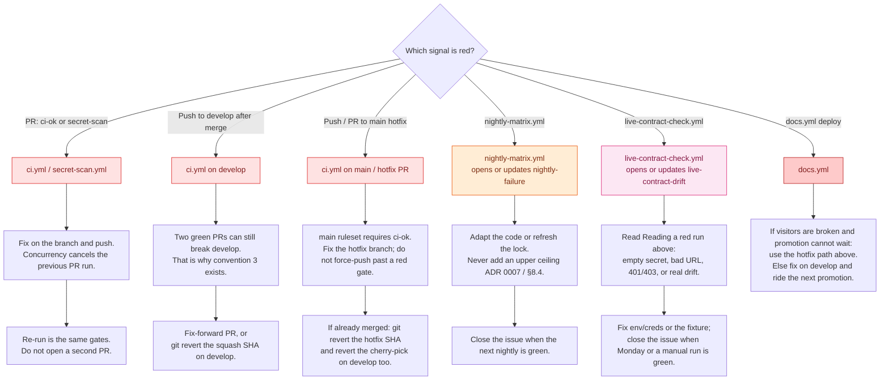

# CI/CD: how the workflows are organised and the rules they follow

This page is the map of the repository's GitHub Actions setup: what each
workflow is for, which signal it is meant to give, and the conventions every
workflow change should follow. It is the design reference for the CI/CD epic
(#711). Each convention below is marked **in place** or **target**, and a
target links the issue that delivers it. When that issue lands, update the
convention's status here in the same PR.

For the commands to run before opening a PR, see the
[pre-PR gate in `CONTRIBUTING.md`](../CONTRIBUTING.md#the-pre-pr-gate). For how
a release reaches PyPI, see [`releasing.md`](releasing.md). For the dependency
policy behind the locks and the nightly run, see
[ADR 0007](adr/0007-dependency-policy.md).

<!-- toc -->
**Contents**

- [The signals](#the-signals)
  - [ci.yml: the PR gate](#ciyml-the-pr-gate)
  - [nightly-matrix.yml: the canary](#nightly-matrixyml-the-canary)
  - [live-contract-check.yml: the gateway contract](#live-contract-checkyml-the-gateway-contract)
- [Scenario maps](#scenario-maps)
  - [Feature or fix (normal path)](#feature-or-fix-normal-path)
  - [Hotfix (into main, then back to develop)](#hotfix-into-main-then-back-to-develop)
  - [Error scenarios and recovery](#error-scenarios-and-recovery)
- [Conventions](#conventions)
  - [1. PR CI resolves from a lock; the nightly run resolves fresh. In place (#982)](#1-pr-ci-resolves-from-a-lock-the-nightly-run-resolves-fresh-in-place-982)
  - [2. One required status check: ci-ok. In place (#755)](#2-one-required-status-check-ci-ok-in-place-755)
  - [3. CI runs on develop, not just on PRs. In place (#755)](#3-ci-runs-on-develop-not-just-on-prs-in-place-755)
  - [4. Every scheduled workflow alerts on failure. Partly in place](#4-every-scheduled-workflow-alerts-on-failure-partly-in-place)
  - [5. One task runner mirrors CI. Target (#765)](#5-one-task-runner-mirrors-ci-target-765)
  - [6. Jobs are bounded and superseded runs are cancelled. In place (#761)](#6-jobs-are-bounded-and-superseded-runs-are-cancelled-in-place-761)
  - [7. Least-privilege workflows. Partly in place (#757, #771)](#7-least-privilege-workflows-partly-in-place-757-771)
  - [8. The site is built on PRs, on a supported Node. In place (#759)](#8-the-site-is-built-on-prs-on-a-supported-node-in-place-759)
  - [9. Release gates are code, not prose. Target (#767)](#9-release-gates-are-code-not-prose-target-767)
  - [10. Workflow names follow one style. In place (#1009)](#10-workflow-names-follow-one-style-in-place-1009)
- [Changing a workflow](#changing-a-workflow)
<!-- tocstop -->

## The signals

Each workflow answers exactly one question. Mixing two signals in one job makes
a red run ambiguous, so a workflow that starts answering a second question
should be split.

| Question | Answered by | When it runs |
| --- | --- | --- |
| Did this change break something? | `ci.yml` (PR-gating jobs, resolving from the committed lock) | Every PR; pushes to `main` and `develop` |
| Did an upstream release break us? | `nightly-matrix.yml`, plus the fresh-resolve jobs in `ci.yml` (`all-extra-resolves`, `anthropic-stacks`, `adk-stacks`) | Daily 06:00 UTC; every PR for the `ci.yml` jobs |
| Did the live gateway's contract drift? | `live-contract-check.yml` (the `openai-model-routing` proxy only) | Mondays 07:00 UTC |
| Did a secret get committed? | `secret-scan.yml` (gitleaks over the full history) | Every PR; pushes to `main` and `develop` |
| Is the published site current? | `docs.yml` (build and deploy to GitHub Pages) | Pushes to `main` under `website/**`; every 6 hours; manual |
| Is the artifact fit to publish? | `publish-testpypi.yml`, `publish-pypi.yml` | Manual dispatch on `develop` / a published GitHub Release |
| Does the PR carry its issue's labels? | `pr-labels.yml` | PR events (`pull_request_target`) |

### `ci.yml`: the PR gate

The jobs, grouped by what they protect:

- **Layering and packaging.** `base-only` installs only the base package and
  runs `tests/unit`, so a framework import leaking into a lower layer fails
  here. It then checks the built wheel in its own environment.
  `all-extra-resolves` dry-runs `pip install ".[all]"` on every supported
  Python (#697). `new-dependencies` checks that any direct dependency new to
  the PR exists on PyPI (#936). `commit-identities` fails a PR whose commits
  carry a placeholder git identity such as `x <x@x>` (#1048).
- **Static checks.** `typecheck-and-lint` runs `mypy`, `ruff check`,
  `lint-imports`, the verification-claim and doc-link checkers, the fixture
  scrub check and `vulture`.
- **Behaviour.** `test` is the Python 3.10–3.12 matrix and includes the
  `local_gateway` suite. `adapter-contract` runs one leg per `ADAPTERS` extra
  with its real framework installed (#742). The framework-specific jobs
  (`anthropic-stacks`, `adk-stacks`, `agent-framework-middleware`,
  `llamaindex-transport`, `agents-strands-last-call`) cover tests that only
  mean something with that framework present.
- **Promises made in the docs.** `benchmark` enforces the < 1 ms span overhead
  (BG §1.6) and trends it across runs. `quickstart` and `langgraph-demo` run
  the documented examples against the local simulator. `docs-llms-drift`
  regenerates `llms.txt` and fails on any diff. `docs-site` builds the site
  and checks its internal links and anchors (#759).
- **The gate itself.** `ci-ok` needs every other job and fails unless each one
  succeeded or was skipped. It is the one required status check (convention 2).

### `nightly-matrix.yml`: the canary

The nightly run resolves fresh against the newest upstream releases, with no
constraints (ADR 0007 rule 4). `matrix` re-verifies the conformance-tested
adapter (LangGraph) against §8 signatures, and `framework-legs` runs every
`ADAPTERS` entry (#748). A live proxy round-trip is available only through
`workflow_dispatch` with `live: true`. A red nightly is an upstream signal: fix
it by adapting the code or by moving the lock, never by adding a ceiling
(`§8.4`). Any failed run, scheduled or manual, opens one issue labelled
`nightly-failure`, or comments on it if it is already open (#755). Close that
issue once the nightly is green again.

### `live-contract-check.yml`: the gateway contract

Every Monday this workflow runs the `sandbox` suite (`tests/sandbox/`) against
one real proxy, `openai-model-routing`. From the repository secrets it writes a
`tests/sandbox/proxies.toml` with that one entry, so tests for every other proxy
skip. The drift guard is `test_openai_routing_response_shape_matches_fixture`.
Any failure opens one issue labelled `live-contract-drift`, or updates it if it
is already open (#753).

**One-time setup.** The workflow names the environment; repository settings
supply its contents. A maintainer with admin rights on the repository sets them
up (#999):

1. Create a `live-sandbox` environment in **Settings → Environments**. Under
   deployment branches, allow only `develop`; scheduled runs use the default
   branch. Leave required reviewers off, because the Monday run is unattended.
   A reviewer would hold every run until someone approved it.
2. Add three environment secrets:

   | Secret | Value |
   | --- | --- |
   | `DONKEY_LLM_PROXY_URL` | The proxy base URL, `https://<gateway-host>/<base-path>`. No `/v1`, same shape as the SDK's `.env` |
   | `DONKEY_LLM_PROXY_CLIENT_ID` | The `client_id` of a consumer app with a contract on that proxy |
   | `DONKEY_LLM_PROXY_CLIENT_SECRET` | That app's `client_secret` |

   `gh secret set <NAME> --env live-sandbox` prompts for each value, so the
   value never reaches your shell history.
3. Check the setup with a manual run, without waiting for Monday:
   `gh workflow run live-contract-check.yml --ref develop`. A healthy run
   passes the `openai-model-routing` tests and skips the rest.

**Reading a red run.**

- *Missing secret(s).* The first step fails the run when a secret is empty.
  Without it, every sandbox test would skip and the run would go green having
  checked nothing.
- *`InvalidURL` in every test, before any request.* `DONKEY_LLM_PROXY_URL` is
  not a plain URL; it may be a truncated or placeholder value. Set it again.
- *A 401 or 403 from the proxy.* The credentials are wrong, or the consumer
  app's contract was revoked.
- *A fixture or shape mismatch.* The gateway's contract really drifted. Track
  it on the `live-contract-drift` issue.

## Scenario maps

Which workflows fire for a change, and what to do when a run goes red. Merge
mechanics (squash vs rebase vs no-ff) live in
[`CONTRIBUTING.md` §1](../CONTRIBUTING.md#1-branch-pr--release-workflow);
these diagrams only show the Actions side.

### Feature or fix (normal path)

Branch from `develop`, PR into `develop`, later promote when a milestone is
ready. `docs.yml` and the publish workflows are optional legs on that path.

Grey boxes are human / git steps. Coloured boxes are workflows: blue =
PR/push gates (`ci.yml`, `secret-scan.yml`), violet = PR hygiene
(`pr-labels.yml`), green = site deploy (`docs.yml`), amber = publish.

Scheduled workflows (`nightly-matrix.yml`, `live-contract-check.yml`, the
`docs.yml` cron) are independent of this path; they keep running on their own
cadence.

### Hotfix (into `main`, then back to `develop`)

The exception when `main` must move without waiting for a full promotion —
usually a broken live docs site (`website/**` / `docs.yml`), sometimes a
package patch. Branch from `main`, rebase-merge one commit, then cherry-pick
onto `develop` via a second PR. A docs hotfix never bumps the version; a
package hotfix does (see [`releasing.md` → Hotfix releases](releasing.md#hotfix-releases)).

Same colour key as the feature path: blue gates, green deploy.

Never merge `main` back into `develop` as a branch merge — only the
cherry-pick PR. Never push straight to `main` without a PR.

### Error scenarios and recovery

Red / orange / pink boxes are the failing workflow; grey boxes are the
recovery steps.

A red PR is expected during development; a red `develop` after merge, a red
nightly, or a red live-contract run is a maintainer signal — track it on the
labelled issue those workflows open, and close that issue only when the signal
is green again.

## Conventions

### 1. PR CI resolves from a lock; the nightly run resolves fresh. **In place** (#982)

PR-gating jobs install with
`-c python/constraints/<job>-py3.NN.txt`. There is one file per job's exact
extras, dev group and Python combination, never merged across combinations
(the reason is in `python/scripts/compile_constraints.py`). Jobs whose purpose
*is* a fresh resolve keep resolving fresh. To refresh the lock, run
`python scripts/compile_constraints.py`, and keep its `_COMBOS` in sync with the
install lines in `ci.yml`.

Still open under #763: pinning the build backend and the release tools,
Dependabot-driven lock bumps, and making `mypy` independent of which extras are
installed. Still open under #769: a lowest-direct job that keeps the declared
floors honest, an `openai<2` leg, and Python 3.13/3.14 in the matrix.

### 2. One required status check: `ci-ok`. **In place** (#755)

An aggregate `ci-ok` job `needs:` every other job, runs with `if: always()`, and
fails if any dependency did not succeed (`skipped` counts as a pass, because
`new-dependencies` and `commit-identities` run on PRs only). The `develop` and `main` rulesets require
only `ci-ok`, so renaming a job or changing a matrix never silently drops a
required check. A new job is added to `ci-ok`'s `needs:` in the same PR;
`tests/unit/test_ci_workflows.py` fails when one is missing.

### 3. CI runs on `develop`, not just on PRs. **In place** (#755)

`ci.yml` also runs on pushes to `develop`, so two individually green PRs that
combine into a broken `develop` are caught at merge time instead of at
promotion. `secret-scan.yml` covers `develop` too. There is no merge queue, so
`ci.yml` has no `merge_group:` trigger; add one if a queue is adopted.

### 4. Every scheduled workflow alerts on failure. **Partly in place**

Each cron workflow ends with an `if: failure()` job or step that opens or
updates one labelled tracking issue (never one issue per run), using
`issues: write` on that job only. `live-contract-check.yml` does this with the
`live-contract-drift` label (#753), and `nightly-matrix.yml` with the
`nightly-failure` label (#755). `docs.yml`'s cron still needs the same step.

### 5. One task runner mirrors CI. **Target** (#765)

Workflows call `nox -s <session>`, one session per blocking CI job, and the
CONTRIBUTING gate documents sessions instead of raw commands. One local command
then reproduces every blocking job. Until this lands, the install and run lines
in `ci.yml` are the source of truth, and CONTRIBUTING's gate is a subset of
them. `.pre-commit-config.yaml` exists today with gitleaks only. #765 adds
ruff, ruff-format, lint-imports and `llms.txt` regeneration.

### 6. Jobs are bounded and superseded runs are cancelled. **In place** (#761)

- Every job in every workflow sets `timeout-minutes`: 10–15 for most jobs, 30
  for jobs that resolve dependencies fresh (`all-extra-resolves`,
  `anthropic-stacks`, `adk-stacks` and the nightly jobs).
- Every matrix sets `fail-fast: false`, so each leg reports on its own.
- `ci.yml` has one `concurrency:` group per PR (per ref for pushes). A new push
  to a PR cancels the PR's previous run. Branch pushes are never cancelled.
- Each `ci.yml` job that installs packages restores a pip cache, but only
  pushes to `main` and `develop` save one (#1005). A PR's own cache would be
  readable by that PR alone, so PRs restore what `develop` saved and add
  nothing to the repository's 10 GB cache quota. The key is the Python minor
  (not the patch, #1004), the job, and the job's constraints file, or
  `python/pyproject.toml` for the fresh-resolve jobs. The cache stores
  downloaded wheels only, so a fresh-resolve job still resolves against the
  index. On #1002, a warm cache did not shorten the run (5m06s warm, 4m39s
  cold): the point is staying under the quota, not speed.

`tests/unit/test_workflow_bounds.py` fails on a job without a timeout of 30
minutes or less, a matrix without `fail-fast: false`, a `ci.yml` without the
concurrency group, or a `ci.yml` cache that a PR run can save. `docs.yml` and `live-contract-check.yml` deliberately
serialise their runs and never cancel one mid-flight.

### 7. Least-privilege workflows. **Partly in place** (#757, #771)

Every workflow declares `permissions:` at the top, and elevated permissions go
only on the job that needs them. The publish workflows grant `id-token: write`
to the publish job alone. Values from `${{ }}` are bound to `env:` and used as
quoted shell variables, never interpolated into a `run:` body. Still open:

- Pin every `uses:` to a full commit SHA with a version comment, starting with
  `pypa/gh-action-pypi-publish` (still on the `release/v1` branch ref).
- Move `docs.yml`'s `pages: write` and `id-token: write` from the workflow to
  the deploy job.
- Add a `.github/dependabot.yml` for actions, pip and npm, a `CODEOWNERS` file
  covering `.github/**` and the other sensitive paths, and workflow linting.
- Pin manual docs deploys to `main` (#771).

### 8. The site is built on PRs, on a supported Node. **In place** (#759)

The `docs-site` job in `ci.yml` builds the site on every PR that touches it,
so broken MDX, a bad import or a dead internal link fails there instead of in
the release deploy. It runs `npm ci`, `npm run typecheck`, `npm run lint`, a
production build with `DOCS_BASE_PATH=/donkey-development-kit` (the project
prefix the Pages deploy uses), and `npm run check:links` over `out/`. The
check is a job-level path test on `website/**` and the two docs workflows, not
a workflow-level `paths:` filter: a skipped workflow would never report
`ci-ok`, the required check (convention 2). The job always starts and its steps
no-op when the PR leaves the site alone. Pushes to `main` and `develop` always
run it. `ci.yml` and `docs.yml` both use Node 24, since Node 20 reached end of
life on 2026-04-30.

### 9. Release gates are code, not prose. **Target** (#767)

Before any upload: the version is read from one source file, the tag equals
`v<version>`, the unit suite passes, and the built wheel installs and imports
in a clean environment. The `pypi` environment requires reviewers, and the
upload generates attestations. The acceptance run against the published
pre-release is listed in `releasing.md`, and its status is attached to the
promotion PR. Today the version lives in both `python/pyproject.toml` and
`python/src/donkey_kit/__init__.py`, kept in sync by `scripts/bump-version.sh`,
and the publish build runs `twine check` and the upper-pin grep only.

### 10. Workflow names follow one style. **In place** (#1009)

The same rules apply in every Donkey-Development-Kit repo:

- **Display name.** The top-level `name:` is what the Actions tab and the PR
  checks show. Write it in sentence case, keep acronyms upper case (CI, PR,
  SDK, UI, PyPI), and use at most four words. No kebab case, no parentheses,
  and no hosting detail such as "GitHub Pages". Start with a verb when the
  workflow does something (`Deploy docs`, `Publish to PyPI`). Use a noun phrase
  when it checks something (`Secret scan`, `Nightly matrix`).
- **Filename.** Kebab case, and don't rename an existing one. PyPI Trusted
  Publishing pins the `publish-*.yml` filenames, docs and scripts refer to
  workflows by filename, and a rename splits the Actions run history.
- **Shared workflows.** A workflow that exists in several repos has the same
  filename and display name in each, such as `ci.yml` / `CI` and
  `sdk-alignment.yml` / `SDK alignment`.
- **Job names.** Renaming a workflow must not rename its jobs. Required status
  checks match on job names: `ci-ok` here, and `<branch> ↔ SDK <branch>` in
  the demos repo.

## Changing a workflow

- Keep each job's header comment accurate. It is the job's spec. Say which
  issue added it and what it protects, and correct it in the same PR when the
  behaviour changes (#755 found comments promising behaviour that did not
  exist).
- A new PR-gating job installs from its own constraints file, gets a
  `_COMBOS` entry in `compile_constraints.py` and a place in `ci-ok`'s
  `needs:`. A new job in `nightly-matrix.yml` goes in `alert`'s `needs:`.
- A new scheduled workflow ships with its failure-alert step (convention 4).
- A change to which tests run where updates the test-surface table in
  [`CONTRIBUTING.md` §2](../CONTRIBUTING.md#2-testing-strategy).
- A change to the dependency policy itself needs an ADR (see
  [`adr/README.md`](adr/README.md)).
