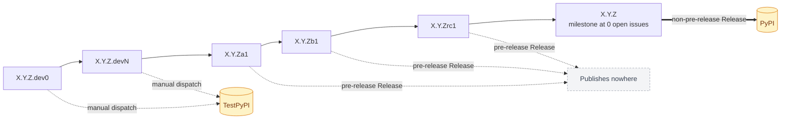
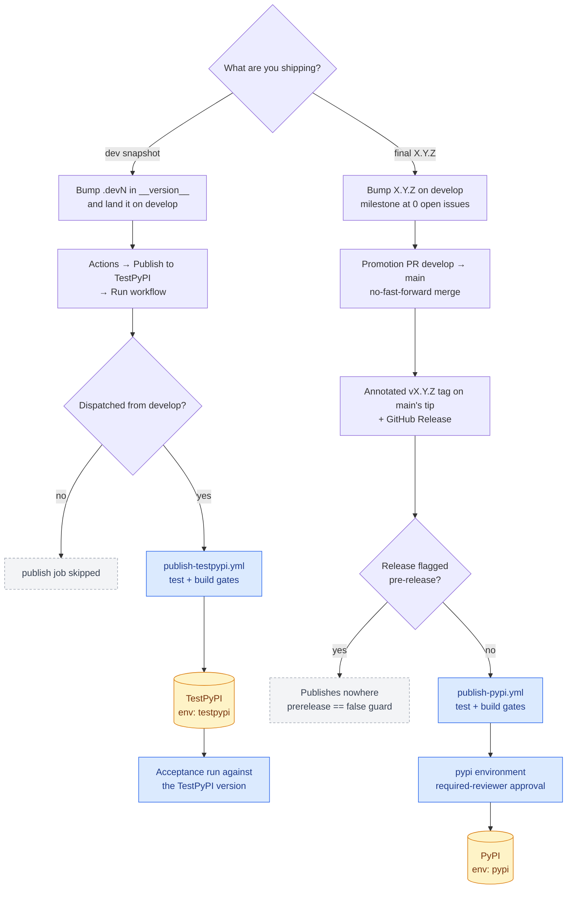
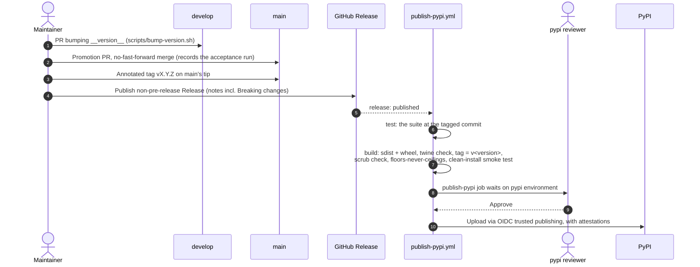
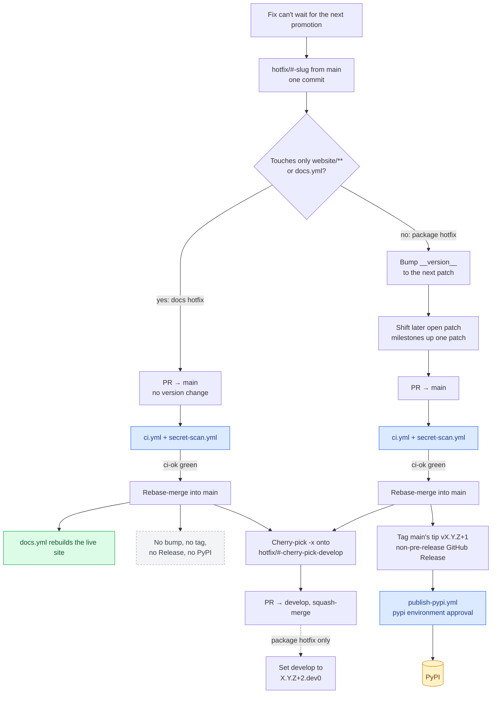

# Releasing `donkey-kit` to PyPI

Maintainer-facing reference for how a release becomes an installable package:
the **version & naming convention** it follows, and the **PyPI publish** wired as
two workflows, `.github/workflows/publish-pypi.yml` and
`.github/workflows/publish-testpypi.yml` (#206, #410, #674). The branch model and the
**promotion merge** that puts release content on `main` (squash to `develop`,
no-fast-forward merge to `main`) live in
[`CONTRIBUTING.md` §1](../CONTRIBUTING.md#1-branch-pr--release-workflow).
The exception path, a fix that lands on `main` without waiting for a
promotion, is covered under [Hotfix releases](#hotfix-releases).

Everything below is self-contained — you should not need any other document to
cut a release.

## Versioning & naming

`donkey-kit` version strings are **PEP 440** (not raw SemVer), so they normalise
cleanly on PyPI. The version is **not invented per release** — it is the version
of the **milestone being shipped**. The milestone titles are the ground truth
(quote them verbatim, em-dash included):

| Milestone (exact title) | Ships version |
| --- | --- |
| `Phase 1 — Build the MVP (0.1.0)` | `0.1.0` |
| `Phase 1.1 — Stabilize the MVP (0.1.1)` | `0.1.1` |
| `Phase 1.2 — Stabilize the MVP (0.1.2)` | `0.1.2` |
| `Phase 1.3 — Stabilize the MVP (0.1.3)` | `0.1.3` |
| `Phase 2 — Differentiate, go beyond (0.2.0)` | `0.2.0` |
| `Phase 3 — Platform capabilities (0.3.0)` | `0.3.0` |
| `Phase 4 — Enterprise readiness (0.4.0)` | `0.4.0` |
| `Phase 5 — Complete rollout (1.0.0)` | `1.0.0` |

Patch milestones (`Phase 1.N`) are added as they're created, so keep this
table in step with them: add a row for each new milestone, and rename the rows
when a [package hotfix](#package-hotfix-next-patch-milestones-shift) shifts
their versions.

A milestone ships its **final** version only when it reaches **0 open issues**.
The `Verification` and `Upstream gaps` milestones have no version and never ship
— they are standing verification discipline gates, not releases.

### The pre-release ladder

Before a milestone is complete, promotions still land on `main` (docs, spec, and
scaffolding ahead of the feature work), and each gets a **pre-release** version
on the ladder toward the milestone's final version. The PEP 440 segments sort so
every pre-release is strictly less than the final, and PyPI orders them
correctly:

```
X.Y.Z.dev0  <  X.Y.Z.dev1  <  …  <  X.Y.Za1  <  X.Y.Zb1  <  X.Y.Zrc1  <  X.Y.Z
   dev0            devN            alpha 1       beta 1      rc 1        final
```

Each rung maps to a different publish outcome. Only `.devN` builds reach
TestPyPI, and only a final `X.Y.Z` reaches production PyPI. Amber boxes are
indexes a build lands on. The grey box is the dead end for pre-release
GitHub Releases.



- **`.devN`** — dev snapshots toward the next version: work in progress on the
  way to the milestone's release, not yet promoted to a pre-release or final.
- **`aN` / `bN`** — alpha/beta: real feature surface exists, still unstable.
- **`rcN`** — release candidate: milestone all-but-complete, final validation.
- **final** (`X.Y.Z`) — the milestone hit 0 open issues and was promoted.

Spell pre-releases in the **normalised PEP 440 form** — `0.1.0a1`, never
`0.1.0-alpha.1` — so the git tag and the PyPI package version match.

### Tags

A release is an **annotated, `v`-prefixed git tag on `main`'s tip** (e.g.
`v0.1.0a1`), one per promotion, plus a GitHub Release. Tags are claims about
`main`, never `develop` or a feature branch. Everything below the milestone's
final version is flagged **pre-release** on its GitHub Release; only a final
`X.Y.Z` drops that flag.

### The version string lives in one file

The version is declared **once**, as `__version__` in
`python/src/donkey_kit/__init__.py`. `python/pyproject.toml` declares the
version `dynamic` and hatch reads it from that line (`[tool.hatch.version]`), so
the built wheel, the sdist and `donkey_kit.__version__` cannot disagree.
`tests/unit/test_release_version.py` fails if `pyproject.toml` declares a
version of its own again.

Bump it on `develop`, in the PR that finishes a version's work, **before** the
promotion PR — so the code on `main` already reads the version its tag will
carry. `scripts/bump-version.sh` does the bump: it asks for the issue that
tracks it (`--issue N`), names the branch `chore/<issue#>-bump-version-<version>`
per the branch convention, edits `__version__`, and opens the PR that closes
that issue. A tag whose version disagrees with `__version__` at that commit
fails the publish before any upload (see [Release gates](#release-gates)).

## How a release reaches PyPI

Publishing uses **PyPI Trusted Publishing (OpenID Connect)** on both indexes —
there is **no long-lived API token** stored in the repo or in Actions secrets.
PyPI mints a short-lived token for the workflow run, keyed on the repository, the
workflow filename, and the GitHub Environment.

There are **two workflows, one per destination** (#410, #674), and they never
overlap:



- **Dev snapshots → TestPyPI, via `publish-testpypi.yml`'s manual
  `workflow_dispatch`.** Dev builds are deliberately **not** GitHub Releases —
  the Releases page is reserved for real releases. To dry-run: bump the
  `.devN` counter (see [Versioning & naming](#versioning--naming)) in
  `__version__` (`scripts/bump-version.sh`), land it on `develop`, then
  **Actions → Publish to TestPyPI → Run workflow** on `develop`. The publish job is guarded to
  `refs/heads/develop` — a dispatch from any other ref is skipped. It
  publishes to `https://test.pypi.org/legacy/` via OIDC — the same
  trusted-publishing path prod uses. Each dry-run needs a fresh `.devN`: a
  filename, once uploaded to TestPyPI, can never be reused, even after
  deletion.
- **Final release → production PyPI, via `publish-pypi.yml` reacting to a
  published GitHub Release.** The **first published GitHub Release is
  `0.1.0`**; that and every later final `X.Y.Z` route to prod. Finish the
  version's work on `develop`, promote `develop → main` (the no-fast-forward
  merge in
  [`CONTRIBUTING.md` §1](../CONTRIBUTING.md#1-branch-pr--release-workflow)),
  then tag `main`'s tip and cut a **non-pre-release** GitHub Release.
  Publishing it fires the prod path. A pre-release GitHub Release, if one is
  ever cut, publishes **nowhere** — `publish-pypi.yml`'s `publish-pypi` job
  still gates on `prerelease == false`, and `publish-testpypi.yml` has no
  `release:` trigger at all, so nothing picks it up. Prod stays protected
  rather than a mis-flagged pre-release being silently routed anywhere.

The final-release path end to end, from the version bump to the upload:



Each workflow runs its own `test` and `build` jobs first, and uploads via
`pypa/gh-action-pypi-publish` only when both pass. The gates are listed in
[Release gates](#release-gates).
Each is **structurally incapable** of reaching the other's destination:
`publish-pypi.yml` has no `workflow_dispatch` trigger, so a manual run can
never fire it; `publish-testpypi.yml` has no `release:` trigger, so a
published Release can never fire it. Neither workflow creates tags or
releases — they only react to them.

## Release gates

A PyPI upload cannot be undone (a release can only be yanked), so every check
that can run before the upload does. The automated ones run in both publish
workflows; the last two are human.

| Gate | Where | Fails when |
| --- | --- | --- |
| Test suite at the release commit | `test` job | `pytest -q` fails on the exact commit being uploaded (same install as `ci.yml`'s `test` job, 3.11). |
| One version, matching tag | `build` job, `scripts/check_release_version.py` | A built dist's metadata carries a version other than `__version__`, or the version isn't a normalised ladder version. On `publish-pypi.yml`, also when the tag isn't exactly `v<version>`, or a non-pre-release Release carries a pre-release version. |
| `twine check`, no tenant identifiers, floors never ceilings | `build` job | The long description doesn't render, a dist carries a tenant identifier or live platform host, or the built metadata has an upper pin. |
| Clean-install smoke test | `build` job, `scripts/smoke_test_wheel.py` | The built wheel doesn't install into a fresh virtualenv, or `import donkey_kit` there fails, imports from anywhere but that virtualenv, or reports a `__version__` other than the installed version. |
| Attestations | publish job | Not a check: the upload carries [PEP 740](https://peps.python.org/pep-0740/) attestations signed with the workflow's OIDC identity (`attestations: true`). |
| Required reviewer | `pypi` environment | A maintainer doesn't approve the production deployment. This is a repository setting (see [One-time human setup](#one-time-human-setup-register-the-trusted-publisher)); the workflow can't enforce it. |
| Acceptance run | By hand, before the promotion PR | See below. |

### The acceptance run

Every gate above tests the source tree or a freshly built wheel. The
maintainers' acceptance suite, kept in a separate private repository, is the
only one that installs the **published** artifact from an index and exercises
it against live gateway proxies. It catches the release where all of CI is
green and consumers still can't use the package.

Run it against the `.devN` version you just published to TestPyPI, before you
open the promotion PR:

```bash
./run.sh --version <the TestPyPI version> --index testpypi
./run.sh --check-coverage
```

Record the result in the promotion PR body: the version tested, the index, and
whether it passed. A promotion with no recorded acceptance run is a promotion
nobody checked.

Read the run's header, not just its exit code. A live group whose proxy isn't
configured skips cleanly, so a run with no credentials exits 0 having tested
nothing live; the header lists which proxies were configured and which were
skipped. If the run fails, don't promote until you know which side is wrong,
and assume the package is at fault until you have shown otherwise.

## Hotfix releases

A hotfix moves `main` without waiting for the next `develop → main`
promotion. Use it only when the fix can't wait: a security fix, production
down, or a broken live docs site (`docs.donkey-kit.dev`, which `docs.yml`
builds from `main`). Everything else waits for the next promotion.

### Merge mechanics

Both kinds of hotfix land the same way. Each step still needs its issue and
its PR.

1. Branch from `main` as `hotfix/<#>-<slug>` and keep the PR to **one
   commit**.
2. PR into `main` and **rebase-merge** it. The `main` ruleset allows only
   merge and rebase, so a squash is rejected. A one-commit rebase lands
   exactly one revertable commit on `main`.
3. Cherry-pick that commit onto `develop` straight away, through a PR:
   branch `hotfix/<#>-cherry-pick-develop` from `origin/develop`, run
   `git cherry-pick -x <sha-on-main>`, and squash-merge the PR. `develop`
   has a pull-request rule, so a direct push is rejected.
4. Never merge `main` back into `develop`. Skipping the cherry-pick means
   the next promotion reverts the hotfix.

### Docs hotfix: no version

A hotfix that touches only `website/**` and/or `.github/workflows/docs.yml`
changes no published artifact. It gets **no version bump, no tag, no GitHub
Release and no PyPI publish**: leave `__version__` alone. It is done when the `docs.yml` run for the merge commit on `main` is
green and the live site serves the fix. A manual redeploy must run with
`--ref main`, because the `github-pages` environment rejects any other ref.

### Package hotfix: next patch, milestones shift

A hotfix that changes the published package ships the **next patch**: a
hotfix on `vX.Y.Z` ships `vX.Y.(Z+1)`. That breaks the usual rule that a
version is the milestone's, so the milestones move to make room:

- If an open milestone already targets `X.Y.(Z+1)`, the hotfix takes that
  version. That milestone and every later open patch milestone on the same
  `X.Y` line move up one patch. Only the version in parentheses changes in
  each title, and their issues stay where they are. Update the
  [milestone table](#versioning--naming) to match in the same change.
- The hotfix PR bumps `__version__` to `X.Y.(Z+1)`, so `main` already reads
  the version its tag will carry.
- After the rebase-merge, tag `main`'s tip `vX.Y.(Z+1)` and cut a GitHub
  Release as usual. A hotfix on a final release is itself final, so it is a
  non-pre-release Release and `publish-pypi.yml` publishes it to PyPI. A
  hotfix on a pre-release (`main` at `X.Y.Za1`, say) keeps climbing the
  ladder (`X.Y.Za2`) instead, takes no milestone version and shifts nothing.
- The cherry-pick PR to `develop` conflicts on the `__version__` line. Resolve it
  by setting `develop` to `X.Y.(Z+2).dev0`, the next unshipped version, so
  `develop` always sorts above `main`.

For example, with `main` at `v0.1.1` and `develop` at `0.1.2.dev2`, a
package hotfix ships `v0.1.2`. `Phase 1.2 (0.1.2)` becomes `(0.1.3)`,
`Phase 1.3 (0.1.3)` becomes `(0.1.4)`, and `develop` moves to `0.1.3.dev0`.

Grey boxes are human / git steps. Blue boxes are gates, amber boxes are
publish targets, and the dashed grey box is a path that publishes nothing.



## The public API surface semver governs

The package follows semantic versioning (PEP 440 spelling). The versioned public
contract — the surface a **major** bump is reserved for breaking — is:

- The **exception taxonomy**: `DonkeyError` and its subclasses (`PolicyViolation`
  and descendants, `AuthError`, `TokenBudgetExceeded`, `UpstreamModelError`,
  `GatewayUnavailable`, …), their inheritance relationships, and the
  `classify()` mapping from a rejection shape to a type.
- The **OpenTelemetry `donkey.*` span attributes** emitted by the telemetry
  layer (the `gen_ai.*` keys are transcribed literals pinned to
  `GEN_AI_SEMCONV_VERSION`; changing that pin is a deliberate, called-out change,
  not a transitive-dependency surprise).
- The public objects reachable from `donkey_kit` top level (`Donkey`,
  `DonkeyConfig`, the `donkey.*` accessors) and each adapter's
  `connection_kwargs()` shape.

Internal modules (`core/_verify.py`, transport internals, the simulator, the
conformance harness) are **not** part of the contract.

There is intentionally **no `CHANGELOG.md`**. The **GitHub Release is the
changelog** (`[project.urls].Changelog` points at the Releases feed); release
notes call out breaking changes, verification-status flips, and extras
changes (the floors-never-ceilings rule). For a pre-release, the notes also state plainly what is *not* yet real
(e.g. "pre-MVP: docs and scaffolding only") so a `.devN` build never reads like a
usable SDK.

Every Release body has a `## Breaking changes` section, even when there are
none: it lists each break with its migration, or says `None.`. It is the first
thing users scan for during the alpha, so it never collapses into a sentence in
the lead.

`gh release create --generate-notes` groups the raw PR list by label, using
`.github/release.yml` (Breaking changes, Features, Fixes, Docs, Maintenance,
Other). GitHub groups by **PR** labels, and in this repo the labels live on
issues, so `.github/workflows/pr-labels.yml` copies the type labels
(`breaking-change`, `enhancement`, `bug`, `documentation`, `chore`,
`dependencies`) from the issues a PR closes onto the PR. A PR with no
`Closes #N`, or whose issue has no type label, lands under Other. Label the
issue, not the PR, and add `breaking-change` to any issue whose fix breaks the
contract above.

## One-time human setup: register the Trusted Publisher

Trust is registered **per index, and keyed on the workflow filename** — each
index must point at the filename that actually publishes to it, or PyPI
rejects the OIDC token. This is a manual step on the web UI (it cannot be
done from CI), performed **once per index**. `donkey-kit` already exists on
both PyPI and TestPyPI, so edit each project's **existing** trusted publisher
(the project's Settings → Publishing) to point at the workflow filename in the
table below. The **pending publisher** form (account → Publishing) is only the
fallback for an index where the project does not exist yet. Enter, on the
**GitHub** tab:

| Field | On **pypi.org** | On **test.pypi.org** |
| --- | --- | --- |
| PyPI Project Name | `donkey-kit` | `donkey-kit` |
| Owner | `Donkey-Development-Kit` | `Donkey-Development-Kit` |
| Repository name | `donkey-development-kit` | `donkey-development-kit` |
| Workflow name | `publish-pypi.yml` | `publish-testpypi.yml` |
| Environment name | `pypi` | `testpypi` |

These must match the workflow exactly or PyPI rejects the OIDC token.

Then, in the GitHub repo (Settings → Environments), create the `pypi` and
`testpypi` **Environments**. Add **required reviewers** to `pypi`: the publish
job then pauses for a human approval before the irreversible production
upload — the go-ahead gate #339 requires, and one of the
[release gates](#release-gates).

> A public PyPI publish is effectively irreversible (names can be squatted;
> releases can only be *yanked*, never deleted). Do not change the
> **production** publisher or approve a `pypi` deployment until the release is
> genuinely ready — #339 was the first-publish checklist (completed 2026-09-25).
